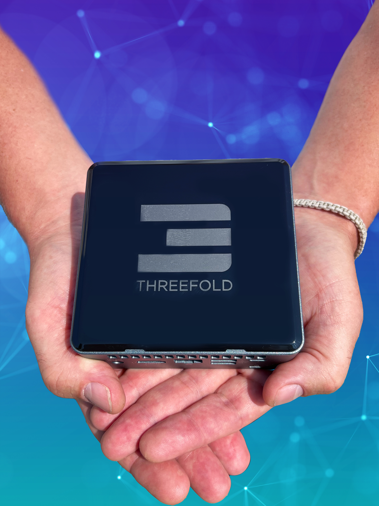

DUBAI, United Arab Emirates | Real Estate developer Paradise Hills and ThreeFold have announced today their plans to add dedicated servers (3Nodes) to approximately 170 homes in the Paradise Hill project, creating the world’s first neighborhood Cloud Network on the ThreeFold Grid.

Through this historic partnership, Paradise Hills Development and ThreeFold aim to provide every homeowner of the gated residence with a pre-installed 3Node, a dedicated server that provides the edge computing and internet storage needed to run decentralized applications and internet services. The initiative will provide residents, businesses, developers and the government with a secure and highly available sovereign cloud infrastructure to store and process their data locally.

“Paradise Hills is set to become the region’s center for true decentralization and the future of tomorrow’s Internet, essentially setting the standard for real estate developments and homeownership globally,” CEO Shaher Mousli of Paradise Hills Development said about the partnership.

“This historic collaboration is the first pilot in a series of initiatives by ThreeFold to help expand the digital landscape of the United Arab Emirates (UAE),” says Adnan Fatayerji, co-founder of ThreeFold. “It will support the development of edge computing, smart cities and IoT, showcasing the power of the private sector to build and drive digital empowerment initiatives in support of the Digital Dubai vision set by the Emirates leadership.”

Over the last decade, “data sovereignty” became a key topic globally, with many countries insisting that any data produced locally should be stored on Internet infrastructures within their borders. By bringing ThreeFold’s decentralized Internet infrastructure to real estate properties such as Paradise Hills, the UAE will be home to the first-of-its-kind, self-sovereign, smart city development in the world.

"Through simple, secure, and scalable technology, ThreeFold empowers millions to invent and explore new experiences," added ThreeFold co-founder Kristof de Spiegeleer. "We want to empower local businesses, creators, and communities to build a more sustainable and inclusive future.”

*You and your communities can participate in the expansion and interconnection of the decentralized Internet as well! More information [here](https://threefold.io/farm/)!*