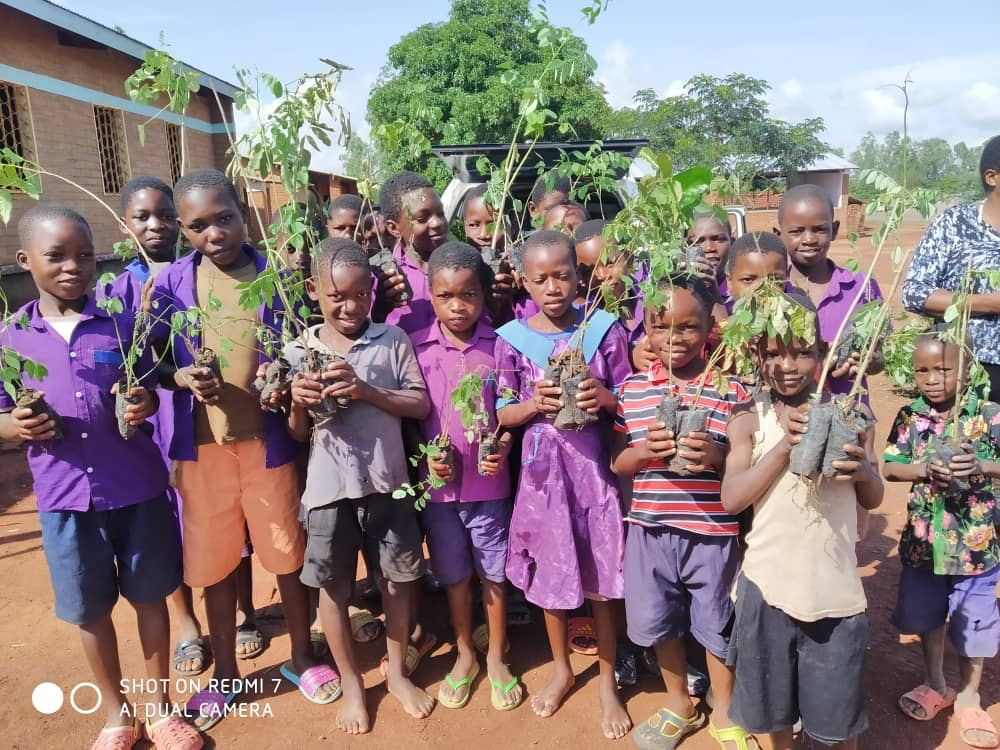

🌳 **Tree-Planting is underway to enable a planet-positive Internet**

Three big Take Action Global and ThreeFold sponsored tree-planting initiatives have gotten started in Malawi 🇲🇼, Cambodia 🇰🇭, and Sierra Leone 🇸🇱 – and soon in the Philippines 🇵🇭 – with **more than 5,000 trees planted so far**!

These actions will help to enable ThreeFold as **the first planet-positive peer-to-peer Internet** infrastructure on earth. Sending so much love to the children and teachers involved in this project. 💚

For project details and to get involved, visit https://earthproject.org/treeplanting

More updates to come.

*In case you missed it, check out [our previously-shared plans](https://forum.threefold.io/t/threefold-on-track-to-be-planet-positive/2097) to enable a regenerative Internet for all! You can find plenty of details in our three-part series.*